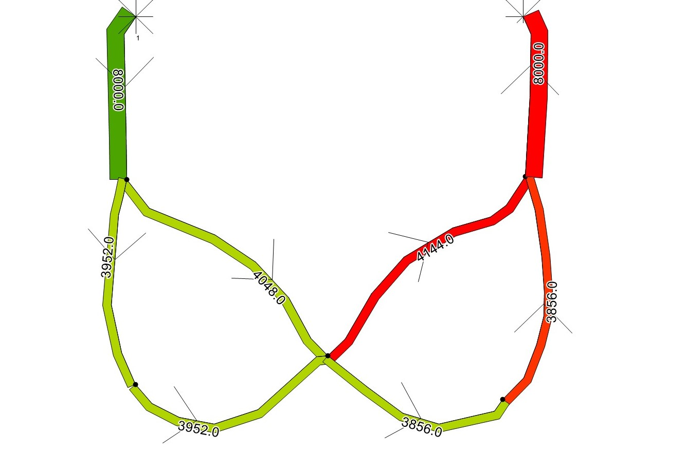

# PLANitIO Unit Tests and Integration Tests

## 1. Unit Tests and Integration Tests

*Unit tests* confirm that individual methods generate the correct result from a known set of input values. They are used to confirm that methods or classes are working correctly, rather than the whole application. If code changes cause a unit test to fail, the developer can immediately review the changes to see what caused the failure.

*Integration tests* test the whole application. They run the whole application using standard input files and confirm that the contents of the output files generated by the program match the expected results.

Unit testing is particularly useful when a team of several developers is working on the same piece of software. In that case each developer must write tests for his own code before integrating it into the larger codebase of the whole project.

We have not written unit tests at the method or class level for the PlanIt application. In the case of PLANit, the development team was small (2 people) and it was sufficient to use integration tests to find issues. Test failures could still be traced back to bugs which caused them.

All tests described in the rest of this document are integration tests.

## 2 Integration Tests

### 2.1 Overview

This section begins with a general description of how the integration tests work, which is applicable to all test cases. It then goes into more detail about the contents of the input and output files which are used in the tests.

### 2.2	General Structure of Integration Tests

Integration tests must use standard input files which define the network, demands and zoning for the test case. In the case of PLANitIO all of these are defined in one XML input file (usually named macroscopicinput.xml).

The expected results should have been generated by another method. These can include:-

- hand calculation (if the test case is simple);
- running the same test case in another application. All the tests in the “Route Choice” section were run on OmniTRANS, whose outputs were recorded for comparison;
- expected error messages, where a test has deliberately invalid inputs in order to test PLANit’s input validation methods.

The expected results generated from these alternative calculation methods are stored in two ways:-

- CSV and XML output files;
- Java data storage objects, usually Java Maps.

PLANitIO stores results from its runs using objects called *output formatters*. It uses two output formatters:

- PLANitOutputFormatter, which writes results to CSV and XML files;
- MemoryOutputFormatter, which stores results in Java memory.

The contents of the CSV results files generated by PLANitOutputFormatter can be compared to the standard results CSV files, and the values stored in Java memory objects are compared to those stored in MemoryOutputFormatter.

The XML results files generated by PLANitIO contain details of the output configuration used in the test, the output CSV files storing the results and the columns included in the output files. But they also contain a timestamp which gives the date and time of the PLANitIO run. This timestamp should never be the same for any two different runs. The tests must check that all the contents of the created XML file *except the timestamp* are the same as those in the standard results file, but the value of the timestamp in the generated file must always differ from that in the standard results file.

Each integration test must include:-

- an XML input file to define the inputs for the test case;
- Java code to run PLANit to read the input file, run the traffic assignment and save the results;
- CSV files to store the expected results (except for tests with invalid inputs to test PLANit’s input validation);
- XML output files;
- Java code to store the expected results in Java;
- Java code to compare the results from the test run with the expected results.

Java contains its own libraries which can read CSV files (Apache Commons CSV) and check that results from a test run match the expected values (JUnit).

The class `PlanItIOTestHelper.java` contains common code which is used to set up and run PLANit for these tests. This class defines:-

- default configuration methods which are used in many of the tests but not all of them;
- utility methods which are used for common file actions (e.g. comparing the contents of one file with another, deleting CSV results files after the test has finished with them).

The class PlanItIOIntegrationTest contains the individual test cases described in Section 3.

### 2.3	Input File Formats

Each test case has an XML input file called macroscopicinput.xml which contains its input data in the standard XML format (using the <macroscopicdemand>, <macroscopicnetwork> and <macroscopiczoning> elements.

### 2.4	Standard Results Files – Naming Convention

All result files have no spaces in their file names. If the user defines configurable elements of the result file to have spaces, PLANit will convert the spaces to underscores.

CSV standard results files use the naming convention:-

\<OutputType\>\_Time Period_\<Time period number\>\_\<Number of Iterations\>.csv

Where:-

\<OutputType\> is one of “Link”, “Path” or “Origin-Destination”

\<Time period number\> is the appropriate time period number for the assignment execution

\<Number of iterations\> is whatever was defined as the maximum number of iterations in the test (for most tests this is either 1 or 500).

Note that Origin-Destination results files use an iteration number one below those for links and paths.  This is because link costs are recalculated at the start of each iteration, using flows from the previous iteration.

So typical CSV output file names include `Link_Time_Period 1_500.csv`,`Origin-Destination_Time_Period 2_1.csv` etc.

XML output files follow a similar naming convention but do not include the number of iterations in their title (number of iterations is included in their content anyway). So the equivalent names to the above examples would be `Link_Time_Period_1.xml` and `Origin-Destination_Time_Period_2.xml`.

If a test case has more than one time period it will produce more than one set of output files. Several tests have three time periods; for these tests the generated results for all time periods are checked.

### 2.5 Results Files Generated During Tests

The unit tests create temporary CSV and XML output files whose contents are compared to the standard output files.  These temporary output files follow a similar naming convention to the standard results files.  The CSV files are named:-

\<OutputType\>RunId_0\_\<Description\>\_Time_Period_\<Time period number\>\_\<Number of Iterations\>.csv

"RunId 0" is part of the file name, and \<Description\> is an appropriate name for the test e.g. "explanatory".

Similarly, XML temporary files are named:-

\<OutputType\>RunId_0\_\<Description\>\_Time_Period \<Time period number\>.xml

So example names of temporary results files include `Link_RunId_0_explanatory_Time Period_1_2.csv` and `Link_RunId_0_explanatory_Time_Period_1.xml`.

For all the contents of the CSV files and *most* of the contents of the XML files, the values in the temporary files should match those in the standard results files.  The one exception to this is the \<timestamp\> element in the XML output file.  This gives the time of the run.  The time stamp value in the temporary results file must be *different* from that in the standard results file, to confirm the two files are from different runs.

Assuming all contents of the temporary results files match or differ from the standard results as expected, the test passes and the temporary results files are deleted.  This ensures the tests do not leave any old files to clutter up directories.

If a developer makes a code change which cause a test to fail, the temporary results file may not be deleted (depending upon which part of the test the failure occurred in).  This can help developers compare the actual results with what was expected.  In this case the developer must delete the temporary files manually before running the tests again.

Most modellers do not need to worry about the contents of the temporary results files since they are deleted.  

### 2.6	Storing Expected Results in Memory – Link Output

Tests of the contents of the MemoryOutputFormatter use data transfer objects (DTOs). These objects are populated with expected result values in the Java code, and then stored in Java Maps. After the traffic assignment run has finished, the values stored in the MemoryOutputFormatter can be compared to these standard results in the code.

Expected results for link output are stored in ResultDto objects. A ResultDto object is populated by its constructor call, which has the following arguments:-

- *startNodeId*		   external id of start node (used to define the link segment);
- *endNodeId*			external id of end node (used to define the link segment);
- *linkFlow*				 flow through link (output);
- *linkCost*				 cost (travel time) of link (output);
- *capacity*				 capacity of the link (input);
- *length*					 length of the link (input);
- *speed*					 travel speed of the link (input).

ResultDto objects are stored in a Java Map whose keys are run id, time period and mode. Test cases may have more than one run, time period or mode so this allows all the results to be stored for each. 

The fifth argument in the ResultDto constructor, total cost to end node, is not currently used. This was originally included to provide a sort order for the ResultDto objects in the Map which stores them. This is quite helpful for human inspection of CSV output files but is not required for computerized testing.

### 2.7	Storing Expected Results in Memory – Path Output

Tests of the contents of the MemoryOutputFormatter for path and origin-destination cost also use a Java Map to store standard results to be compared to the outputs from the traffic assignment run.  But the content of the data stored in this Map is simpler than for links, since there is only one output value to be compared to the standard results.

Path output maps use five values as keys:-

- mode;
- time period;
- iteration number;
- origin zone external Id;
- destination zone external Id.

Expected paths are stored as a String, which consists of a series of values representing the nodes in the path surrounded by square brackets e.g. "[11,1,2,4,12]".

The Java code gets an iterator through rows of the MemoryOuptutFormatter for the columns corresponding to the keys above for the “PATH_STRING” output property type.  This gives an output path corresponding to each origin zone and destination zone (identified by external Id).  The path value in each row of the MemoryOutputFormatter is compared to the standard path from the Java Map.  If the paths do not agree for a given pair of origin and destination zones, the test fails.

### 2.8	Storing Expected Results in Memory – Origin-Destination Output

Tests of Origin-Destination costs stored in the MemoryOutputFormatter are done in an almost identical manner to tests of the path described in the previous section.  Values are stored in a Java Map by the external Ids of origin and destination zones, and these are used to identify rows in the MemoryOutputFormatter results which are iterated through.
The only difference is that origin-destination costs are stored as doubles whereas paths are stored as strings.  The code simply compares the expected cost with the calculated cost, issuing a test failure if they do not match.
It was noted in Section 2.4 that Origin-Destination output files use an iteration number one lower than those for paths and links.  This applies to the MemoryOutputFormatter also.  The code to run the tests for Origin-Destination must decrement the iteration counter by one to identify the correct position in the MemoryOutputFormatter. 

## 3 Test Cases

### 3.1	Explanatory Test

The test in Section 3.1 use the the basic example included in the ReadMe.Md file for the PLANitIO project. This illustrates the input and output files for the simplest possible network, one link with a demand of one unit across it. This allows modellers to relate the introductory example in the documentation to a real test case.

**Test Configuration**

- Traditional Static Assignment
- MSA Smoothing Method
- Link Based Relative Duality Gap Function
- BPR Cost Function

#### 3.1.1 explanatory_original

***Purpose:***       

This test corresponds to running the Explanatory network.  It is the simplest possible test case which can generate a result.  
The input file specifies values for all link and mode parameters, no default values are used.

***Description:***

- The link has a demand of 10 units from Node 1 to Node 2. 
- The road is single-lane, one-way from Node 1 to Node 2. 
- The capacity of the link is 2000.

***Location:***

`src\test\resources\testcases\explanatory\xml\original`

All input and output files are in this directory.

***Notes:***

This test has turned out to be very useful *because* it is so trivial. If you make a code change which causes this test to fail, you know you have made a mistake or mistype in your code changes to cause the failure. And it is usually easy to trace back to the coding error which causes a wrong result in this case.

#### 3.1.2 explanatory_defaults 

***Purpose:*** 

This test validates that PLANit inserts the correct default values when optional elements are omitted from the input file.

***Description:***

- As “explanatory_original” above
- The link has a demand of 10 units from Node 1 to Node 2. 
- The road is single-lane, one-way from Node 1 to Node 2. 
- The capacity of the link is 2000.

***Location:***

`src\test\resources\testcases\explanatory\xml\defaults`

All input and output files are in this directory.

***Notes:***

This test uses a stripped-down version of the input XML file for the explanatory test case, with all the optional elements omitted.  This tests confirms that PLANit handles these omissions correctly, creating objects with default values.  

#### 3.1.3 explanatory_attempt_to_change_locked_formatter

***Purpose:***

This test validates that PLANit’s formatter locking validation is working.

When PLANit runs a traffic assignment execution, it locks the setup of all its output type configurations. Any attempt to add properties to or remove properties from an output type configuration after this should throw an exception. This test includes code to add properties to the link output type configuration after the traffic assignment has been run, which should generate an exception.

***Description:***

- As “test_explanatory_original” above
- The link has a demand of 10 units from Node 1 to Node 2. 
- The road is single-lane, one-way from Node 1 to Node 2. 
- The capacity of the link is 2000.

***Location:***

`src\test\resources\testcases\explanatory\xml\original`

All input and output files are in this directory.

***Notes:***

If this test works correctly, it should run the traffic assignment once and then throw an exception. This first run will generate output files which should match “test_explanatory” above, but it should throw the exception without writing any results to the MemoryOutputFormatter.

#### 3.1.4 explanatory_link_segment_in_same_direction

***Purpose:*** 

This test confirms that the code throws an exception if two link segments in the same link are in the same direction.

***Description:***

- As “explanatory_original” above.
- The link has a demand of 10 units from Node 1 to Node 2. 
- The road is single-lane, one-way from Node 1 to Node 2. 
- The capacity of the link is 2000.  
- The two \<linksegment\> elements in the \<link\> are deliberately in the same direction, which should generate an exception.

***Location:***

`src\test\resources\testcases\explanatory\xml\linkSegmentsInSameDirection`

***Notes:***

This test does not generate any results.  It is expected to throw the exception before the traffic assignment is ever run.

#### 3.1.5 explanatory_no_geolocation_elements

***Purpose:***

This test confirms that the default values of connectoid length are inserted when no length or geolocation elements are included in the \<connectoid\> elements.

***Description:***

- As “explanatory_original” above.
- The \<connectoid\> elements in the input XML file do not contain \<length\> or \<gml:Point\> elements.
- This test uses the SpeedConnectoidTravelTimeCost method for setting connectiod travel times. 
- The results are the same as for "explanatory_original" above.

***Location:***

`src\test\resources\testcases\explanatory\xml\noGeolocationElements`

***Notes:***

The default behaviour for connectoids, if both <length> and <gml:Point> elements are missing, is to assume a default connectoid length of zero.  This gives a zero travel cost.

#### 3.1.6 explanatory_no_geolocation_elements_with_length_1

***Purpose:***

This test checks that the SpeedConnectoidTravelTimeCost method generates a positive connectoid travel time if the length of a connectoid is greater than zero.

***Description:***

- As “explanatory_original” above.
- The \<connectoid\> elements in the input XML file each have a \<length\> with value 1.
- This test uses the SpeedConnectoidTravelTimeCost method for setting connectiod travel times. 

***Location:***

`src\test\resources\testcases\explanatory\xml\noGeolocationElementsWithLength1`

***Notes:***

The origin-destination cost for this test case is 10.08, compared to 10.0 for all the other explanatory test cases.  
This is because the connectoids have a length 1 and use the default speed of 25.  So each connectoid adds 1/25 = 0.04 to the travel time, and there are two of them.

#### 3.1.7 explanatory_not_specified_which_traveller_type_being_used

***Purpose***

This test checks that the code throws an exception when the \<userclass\> type does not specify which \<travellertype\> element it is using, when there is more than one \<travellertype\> available.

***Description***

- As “explanatory_original” above.
- The input file defines two <travellertype> elements with different ids.  There is only one \<userclass\> element which has no "travellertyperef" attribute.

***Location***

`src\test\resources\testcases\explanatory\xml\notSpecifiedWhichTravellerTypeBeingUsed`

***Notes***

This test is expected to throw an exception before any results are generated, so there are no standard results files in the directory.  
The "travellertyperef" attribute can only be omitted from the \<userclass\> element when there is only one traveller type.  If there is more than one traveller type, each user class must specify which traveller type it uses.

#### 3.1.8 explanatory_reference_to_missing_traveller_type

***Purpose***

This test confirms that PLANitIO throws an exception when \<userclass\> refers to a \<travellertype\> which has not been defined.

***Description***

- As “explanatory_original” above.
- The \<userclass\> element has a "travellertyperef" attribute with a value of 2, but no \<travellertype\> element with this id has been defined.

***Location***

`src\test\resources\testcases\explanatory\xml\referenceToMissingTravellerType`

***Notes***

This test is expected to throw an exception before any results are generated, so there are no standard results files in the directory.  

#### 3.1.9 explanatory_traveller_type_ref_missing_from_user_class

***Purpose***

This test confirms that the \<userclass\> uses the default traveller type when no \<travellertype\> element is included in the input file.

***Description***

- As “explanatory_original” above.
- No \<travellertype\> element is included, and the \<userclass\> element does not include a "travellertyperef" attribute.

***Location***

`src\test\resources\testcases\explanatory\xml\travellerTypeMissingFromUserClass`

***Notes***

PLANitIO should create a default traveller type when none is defined explicitly.  Since there is only one traveller type, every user class must use it, so omitting the "travellertyperef" attribute from the \<userclass\> element is acceptable in this circumstance.

#### 3.1.10 explanatory_traveller_types_but_no_user_classes

***Purpose***

This test confirms that PLANitIO throws an exception when the default user class refers to a traveller type which has not been defined.

***Description***

- As “explanatory_original” above.
- Two \<travellertype\> elements are included in the input file, but no \<userclass\> element.  The traveller types have id values of 2 and 3, so neither matches the default value of 1 which is generated when no \<userclass\> element is defined.

***Location***

`src\test\resources\testcases\explanatory\xml\travellerTypesButNoUserClasses`

***Notes***

This test is expected to throw an exception before any results are generated, so there are no standard results files in the directory. 
When the \<userclass\> element is omitted, PLANitIO creates a single default user class, which is assumed to use a traveller type with an id of 1. 
But in this case the traveller types have been explicitly defined and none have an id of 1, so an exception should be thrown.

#### 3.1.11 explanatory_time_period_external_id_test

***Purpose***

Test case in which the time period external Id values do not match the internally generated Id values.

***Description***

- As “explanatory_original” above.
- The only difference from the explanatory_original test case is that the <timeperiod> element has an id value of 2 and a name of "Time Period 2".  This value is correctly reference in the <odcellbycellmatrix> element's "timeperiodref" atrribute.

***Location***

`src\test\resources\testcases\explanatory\xml\timePeriodExternalIdTest`

***Notes***

This test case gives the same result as the explanatory_original test case. It just so happens that most of the test cases use an external Id value for time period which is the same as the internally generated id.
In general these values are not the same and the input file should use the external Id.  In this test the external Id is deliberately different, to check that the external Id is the one being used.

#### 3.1.11 explanatory_report_zero_outputs

***Purpose***

Tests and illustrates the output when the persistZeroFlow flag is set to true.

***Description***

- As “explanatory_original” above.
- The only difference from the explanatory_original test case is that the persistZeroFlow input is set to true.

***Location***

`src\test\resources\testcases\explanatory\xml\reportZeroOutputs`

***Notes***

The output files now include rows for links and paths with zero flow along them.

### 3.2 Tests for Duplicate External Ids 

***Purpose:***

 These tests check that PLANit's input validation catches duplicate external Id values on input.

***Description:***

 All these tests have a duplicate external Id in their input.  The unit tests pass if the code throws an appropriate exception.  

***Location:***

`src\test\resources\testcases\duplicate_tests\xml\duplicateLinkSegmentExternalId`
`src\test\resources\testcases\duplicate_tests\xml\duplicateLinkSegmentTypeExternalId`
`src\test\resources\testcases\duplicate_tests\xml\duplicateModeExternalId`
`src\test\resources\testcases\duplicate_tests\xml\duplicateTimePeriodExternalId`
`src\test\resources\testcases\duplicate_tests\xml\duplicateUserClassExternalId`
`src\test\resources\testcases\duplicate_tests\xml\duplicateZoneExternalId`

***Notes:*** 

No standard results files are used in these tests, each test is expected to throw an exception before getting to the point of writing any output.

### 3.3 Tests using the Basic Network

This is a simple network for which the lowest cost paths can easily by calculated by hand.  All of these test use only one iteration, that is enough to allocate flows to this simple network.

These tests allow modellers to check the results from PLANit against examples which can easily be calculated by hand.

Some of these test cases use initial cost files, to test that the methods for reading initial costs work with one or two initial cost files.  The contents of the initial cost files are the same as the network link costs, so they do not affect the results.

Unless otherwise stated, these the input files for these tests use the <maxspeed> element under <node> to define the maximum speed along a link.

**Test Configuration**

- Traditional Static Assignment
- MSA Smoothing Method
- Link Based Relative Duality Gap Function
- BPR Cost Function
- FixedConnectoidTravelTimeCost, with connectoid travel time zero

#### 3.3.1 basic_shortest_path_algorithm_a_to_b_one_initial_cost_file

***Purpose:***

Test that PlanItProject reads in the values of one initial costs file.

***Description:***

- This test has a demand of 1 unit, with Node A in the diagram being the origin.  It calcuates the lowest cost path to Node B.  
- It can be found from hand calculation that the lowest cost path has a total cost of 85. 

***Location:***

`src\test\resources\testcases\basicShortestPathAlgorithm\xml\AtoB`

***Notes:***

This test was written just to test that the reading of initial costs from one file works without error.  The values of the initial costs do not affect the result.

#### 3.3.2 basic_shortest_path_algorithm_a_to_b_two_initial_cost_files

***Purpose:*** 

Test that PlanItProject reads in the values of two initial costs files

***Description:***

- This uses the same network as illustrated in 3.4.1.  
- The demand is 1 unit from Node A to B, with a path cost of 85.

***Location:***

`src\test\resources\testcases\basicShortestPathAlgorithm\xml\AtoB`

***Notes:***

This test was written just to test that the reading of initial costs from two files works without error.  The values of the initial costs do not affect the result.

#### 3.3.3 basic_shortest_path_algorithm_three_time_periods

***Purpose:*** 

Tests of results for a simple test case using three time periods.

***Description:***

- This uses the same network as illustrated in 3.4.1.
- Time Period 1 uses route A to B in the example, which has a total route cost of 85 (the fifth argument in the ResultDto constructor). 
- Time Period 2 uses route A to C in the example, which has a total route cost of 77. 
- Time Period 3 uses route A to D in the example, which has a total route cost of 108.

***Location:***

`src\test\resources\testcases\basicShortestPathAlgorithm\xml\ThreeTimePeriods`

***Notes:***

This tests checks that the results from one time period do not interfere with the results from another.

#### 3.3.4 basic_shortest_path_algorithm_a_to_c

***Purpose:*** 

Confirms that the output from a PLANit traffic assignment for the basic network matches a standard result which can be calculated by hand.

***Description:***

- This uses the same network as illustrated in 3.4.1.  
- The demand is 1 unit from Node A to C, with a path cost of 77.

***Location:***

`src\test\resources\testcases\basicShortestPathAlgorithm\xml\AtoC`

***Notes:***

#### 3.3.5 test_basic_shortest_path_algorithm_a_to_c_with_link_segment_maximum_speed

***Purpose:*** 

This test verifies that PLANitIO reads the correct value of <maxspeed> when there the <linksegment> and <mode>

***Description:***

- This uses the same network as illustrated in 3.4.1.  
- The demand is 1 unit from Node A to C, with a path cost of 77.

The input XML file differs from that in 3.4.4 in the way maximum link speeds are configured.  The value of the <maxspeed> element in the <mode> element is 2, but an element <maxspeed> with value 1 is included in every <linksegment> element.
The code is written to take the lower of these two when they are different for a given link-mode combination.

***Location:***

`src\\test\\resources\\testcases\\basic\\xml\\test2LinkSegmentMaximumSpeed`

***Notes:***

Setting the maximum speed along link segments to 1, which is lower than the maximum speed for link segment types of 2, means that the maximum speeds should come out as 1 for every link (the lower of the two alternatives).
This means the code should create a network the same as for 3.4.4, and so should give the same results.  

#### 3.3.6 basic_shortest_path_algorithm_a_to_d

***Purpose:*** 

Confirms that the output from a PLANit traffic assignment for the basic network matches a standard result which can be calculated by hand.

***Description:***

- This uses the same network as illustrated in 3.4.1.  
- The demand is 1 unit from Node A to D, with a path cost of 108.

***Location:***

`src\test\resources\testcases\basicShortestPathAlgorithm\xml\AtoD`

***Notes:***

#### 3.3.7 basic_shortest_path_algorithm_three_time_periods_record_zero_flow

***Purpose:*** 

Tests and illustrates the outputs when the persistZeroFlow input is set to "true" (normally it is false).

***Description:***

- This uses the same network as illustrated in 3.4.1.
- Time Period 1 uses route A to B in the example, which has a total route cost of 85 (the fifth argument in the ResultDto constructor). 
- Time Period 2 uses route A to C in the example, which has a total route cost of 77. 
- Time Period 3 uses route A to D in the example, which has a total route cost of 108.
- The persistZeroFlow input is set to true, which causes the output files for links, OD cost and path to record values even for links and paths which have zero flow along them.

***Location:***

`src\test\resources\testcases\basicShortestPathAlgorithm\xml\ThreeTimePeriodsRecordZeroFlow`

***Notes:***

The output paths and OD costs for this test case include a value from every possible to every other one.  It can be checked by hand that the output paths and costs are correct.

### 3.4 Tests for Reading Initial Cost Values

These tests verify the that initial cost files are read in correctly and their values are correctly stored in link segment objects.  They do not run the traffic assignment.
These tests use the same input network as the “Tests using the Basic Network” test cases in Section 3.4, but they do not run the traffic assignment.  The network files are only included to allow the CustomPlanItProject object to be instantiated.

**Test Configuration**

- Traditional Static Assignment
- MSA Smoothing Method
- Link Based Relative Duality Gap Function
- BPR Cost Function
- FixedConnectoidTravelTimeCost, with connectoid travel time zero

#### 3.4.1 reading_initial_cost_values

***Purpose:*** 

Tests that the values of an initial costs file are read in by start and end node and registered by PlanItProject, and that the stored values match the expected ones by link external id.

***Description:***

This test does not run the traffic assignment.  It reads a files of initial cost values which identifies links by the external ids of upstream and downstream nodes into PlanIt.  It then tests that these values match those in another file which contains in another file which identifies links by link segment external id.

***Location:***

`src\test\resources\testcases\initial_costs\xml\readingInitialCostValues`

***Notes:***

Only the initial costs file which identifies links by their start and end node is actually read into PLANit.  The other file provides values to verify that it PLANit has stored the data correctly.

#### 3.4.2 reading_initial_cost_values_with_missing_rows

***Purpose:*** 

Tests that the read in initial costs values match the expected ones when there are some rows missing in the standard results files.

***Description:***

- This test reads in a file of initial costs, and compares the stored results to those in a standard results file.
- The standard results file does not have values for all the link segments, but the test should successfully match those values it does have to corresponding values which have been stored.

***Location:***

`src\test\resources\testcases\initial_costs\xml\readingInitialCostValues`

***Notes:***

#### 3.4.3 test_reading_initial_cost_values_with_missing_rows_in_input_file

***Purpose:*** 

Tests that PlanItProject throws an exception when the input XML is missing some link segments which are included in the initial costs file.

***Description:***

Tests that PlanItProject throws an exception when the initial costs file references a link segment which has not been defined

***Location:***

`src\test\resources\testcases\initial_costs\xml\readingInitialCostValuesWithLinkSegmentsMissingInputFile`

***Notes:***

### 3.5 Route Choice Tests

Tests in Section 3.5 use more complicated networks.  The networks have previously been run on OmniTRANS.

**Test Configuration**

- Traditional Static Assignment
- MSA Smoothing Method
- Link Based Relative Duality Gap Function
- BPR Cost Function
- FixedConnectoidTravelTimeCost, with connectoid travel time zero

**Naming Convention**

The names of the test cases in this section use the following abbreviations:-

- SIMO: Single-In-Multi-Out
- MISO: Multi-In-Single-Out
- MIMO: Multi-In-Multi-Out

These refer to the types of nodes in the network.  So if the name include SIMO, it means at least one of its nodes has one link coming in and at least two links going out.

#### 3.5.1 1_no_route_choice_single_mode

***Purpose:*** 

This test the traffic assignment for a non-trivial network using one mode.

***Description:***

- All links have a length of 1 km.
- All links use a BPR cost function with alpha = 0.5 and beta = 4.0.
- All links have a maximum speed of 100 km/h and a capacity of 2000 veh/h/lane, except for link 2 which has a capacity of only 1000/veh/h/lane.
- All links have 1 lane, except links 4,7 and 8 which have 10 lanes.
- Travel demand is only non-zero on Origin-Destinations (3 to 4), (5 to 1) and (2 to 6). and 5,1 and 2,6. These have a demand of 1000 veh/h.
- Simulation time period is 1 h.

The resulting flows are:-

And the link costs are:-

***Location:***

`src\test\resources\testcases\route_choice\xml\noRouteChoiceSingleMode`

***Notes:***

Due to the one-way natures of its link segments, all the traffic in this network flows in a clockwise direction.

#### 3.5.2 2_SIMO_MISO_route_choice_single_mode

***Purpose:*** 

This test the traffic assignment for a non-trivial network using one mode.  The network has one SIMO node (Node 1) and one MISO node (Node 4). 

***Description:***

- All links have a length of 1 km, except for links 4 and 5 which are 2 km in length.
- All links use a BPR cost function with alpha = 0.5 and beta = 4.0.
- All links have a maximum speed of 60 km/h and a capacity of 1200 veh/h/lane. 
- All links have 1 lane, except for links 1 and 3 who have 3 lanes.
- The travel demand from 1 from 2 is 3600 veh/h.
- Simulation time is 1 h.

The equilibrium result after 500 iterations using regular MSA smoothing yields the following link flow rates:-

And the following link costs:-

***Location:***

`src\test\resources\testcases\route_choice\xml\SIMOMISOrouteChoiceSingleMode`

***Notes:***

#### 3.5.3 2_SIMO_MISO_route_choice_single_mode_with_initial_costs_and_one_iteration

***Purpose:*** 

This test checks that PlanItProject reads the initial costs from a file correctly, and outputs them after the first iteration.
The test input initial costs file uses Link Segment Id to identify link segments.

***Description:***

This test uses the same network as 3.5.2.

***Location:***

`src\test\resources\testcases\route_choice\xml\SIMOMISOrouteChoiceSingleModeInitialCostsOneIteration`

***Notes:***

#### 3.5.4 2_SIMO_MISO_route_choice_single_mode_with_initial_costs_and_one_iteration_and_three_time_periods

***Purpose:*** 

This test runs the same network using one iteration with different initial costs for each time, checking that the results are different for each time period.

***Description:***

- This test uses the same network as 3.5.2.
- All links have a length of 1 km, except for links 4 and 5 which are 2 km in length.
- All links use a BPR cost function with alpha = 0.5 and beta = 4.0.
- All links have a maximum speed of 60 km/h and a capacity of 1200 veh/h/lane. 
- All links have 1 lane, except for links 1 and 3 who have 3 lanes.
- The travel demand from 1 from 2 is 3600 veh/h.
- Simulation time is 1 h.

***Location:***

`src\test\resources\testcases\route_choice\xml\SIMOMISOrouteChoiceInitialCostsOneIterationThreeTimePeriods`

***Notes:***

#### 3.5.5 2_SIMO_MISO_route_choice_single_mode_with_initial_costs_and_one_iteration_using_link_segment_external_ids

***Purpose:*** 

This test checks that PlanItProject reads the initial costs from a file correctly, and outputs the expected results after the first iteration.
The test input initial costs file uses Link Segment External Id to identify link segments.

***Description:***

This test uses the same network as 3.5.2.
- All links have a length of 1 km, except for links 4 and 5 which are 2 km in length.
- All links use a BPR cost function with alpha = 0.5 and beta = 4.0.
- All links have a maximum speed of 60 km/h and a capacity of 1200 veh/h/lane. 
- All links have 1 lane, except for links 1 and 3 who have 3 lanes.
- The travel demand from 1 from 2 is 3600 veh/h.
- Simulation time is 1 h.

***Location:***

`src\test\resources\testcases\route_choice\xml\SIMOMISOrouteChoiceInitialCostsOneIterationExternalIds`

***Notes:***

#### 3.5.6 2_SIMO_MISO_route_choice_single_mode_with_initial_costs_and_500_iterations

***Purpose:*** 

This test checks that PlanItProject reads the initial costs from a file correctly, and can then generate the expected results after 500 iterations.
The test input initial costs file uses Link Segment Id to identify link segments.

***Description:***

- This test uses the same network as 3.5.2.
- All links have a length of 1 km, except for links 4 and 5 which are 2 km in length.
- All links use a BPR cost function with alpha = 0.5 and beta = 4.0.
- All links have a maximum speed of 60 km/h and a capacity of 1200 veh/h/lane. 
- All links have 1 lane, except for links 1 and 3 who have 3 lanes.
- The travel demand from 1 from 2 is 3600 veh/h.
- Simulation time is 1 h.

***Location:***

`src\test\resources\testcases\route_choice\xml\SIMOMISOrouteChoiceSingleModeWithInitialCosts500Iterations`

***Notes:***

#### 3.5.7 2_SIMO_MISO_route_choice_single_mode_with_initial_costs_and_500_iterations_and_three_time_periods

***Purpose:*** 

This test runs the network with three time periods with different initial costs for each, running the test for 500 iterations.

***Description:***

- This test uses the same network as 3.5.2.
- All links have a length of 1 km, except for links 4 and 5 which are 2 km in length.
- All links use a BPR cost function with alpha = 0.5 and beta = 4.0.
- All links have a maximum speed of 60 km/h and a capacity of 1200 veh/h/lane. 
- All links have 1 lane, except for links 1 and 3 who have 3 lanes.
- The travel demand from 1 from 2 is 3600 veh/h.
- Simulation time is 1 h.

***Location:***

`src\test\resources\testcases\route_choice\xml\SIMOMISOrouteChoiceSingleModeWithInitialCosts500IterationsThreeTimePeriods`

***Notes:***

#### 3.5.8 2_SIMO_MISO_route_choice_single_mode_with_initial_costs_and_500_iterations_using_link_segment_external_ids

***Purpose:*** 

This test checks that PlanItProject reads the initial costs from a file correctly, and outputs them after 500 iterations.
The test input initial costs file uses Link Segment External Id to identify link segments.

***Description:***

This test uses the same network as 3.5.2.
- All links have a length of 1 km, except for links 4 and 5 which are 2 km in length.
- All links use a BPR cost function with alpha = 0.5 and beta = 4.0.
- All links have a maximum speed of 60 km/h and a capacity of 1200 veh/h/lane. 
- All links have 1 lane, except for links 1 and 3 who have 3 lanes.
- The travel demand from 1 from 2 is 3600 veh/h.
- Simulation time is 1 h.
***Location:***

`src\test\resources\testcases\route_choice\xml\SIMOMISOrouteChoiceSingleModeWithInitialCosts500IterationsLinkSegmentExternalIds`

***Notes:***

#### 3.5.9 3_SIMO_MIMO_MISO_route_choice_single_mode

***Purpose:*** 

This verifies that the results calculated by PLANit match those previously calculated by OmniTRANS for a network with different capacities on each link.
This network has one MIMO node (Node 3), one SIMO node (Node 1) and one MISO node (Node 5).

***Description:***

- All links have a length of 2 km.
- All links use a BPR cost function with alpha = 0.5 and beta = 4.0.
- All links have a maximum speed of 100 km/h.

Capacity per lane:
- Link 1: 4 lanes, 2000 veh/h/lane (8000)
- Link 2: 2 lanes, 1500 veh/lane (3000)
- Link 3: 2 lanes, 2500 veh/lane (5000)
- Link 4: 2 lanes, 2000 veh/lane (4000)
- Link 5: 1 lane, 2000 veh/lane (2000)
- Link 6: 2 lanes, 1500 veh/lane (3000)
- Link 7: 1 lane, 2000 veh/lane (2000)
- Link 8: 1 lane, 2000 veh/lane (2000)
- The travel demand from 1 to 2 is set to 8000 veh/h.
- Simulation time period is 1 h.

The equilibrium results after 500 iterations using yield the following link flow rates:-

And the following link costs:-

***Location:***

`src\test\resources\testcases\route_choice\xml\MIMOrouteChoiceSingleMode`

***Notes:***

#### 3.5.10 4_bi_directional_links_route_choice_single_mode

***Purpose:*** 

This test case uses the <odrowmatrix> method in the macroscopicinput.xml file to define the OD demands input matrix.

***Description:***

All links are bi-directional.

All links have a length of 1 km except for
- Links 1 and 2 have a length of 0.9 km
- Links 11 and 12 have a length of 3 km
- Link 9 and 10 have a length of 2.9 km
- All links use a BPR cost function with alpha = 0.5 and beta = 4.0
- All links are bi-directional.

Regular (blue) links:
- Maximum speed: 100 km/h 
- Capacity: 1500 veh/h/lane
- Have 1 lane

Connector links (dashed red):
- Maximum speed: 50 km/h
- Capacity: 1000 veh/h/lane
- Have 10 lanes

Demand:
The origin – destination travel demands are given in the table below:-

|From/to|1 |2 |3 |4 |
|-------|--|--|--|--|
|1|100.000|200.000|300.000|400.000|
|2|200.000|400.000|600.000|800.000|
|3|300.000|600.000|900.000|1200.000|
|4|400.000|800.000|1200.000|1600.000|

- Simulation time period is 1 h.
- The run uses 500 iterations.

Link flow results are shown below per link direction:-

The generalised link costs associated with each link (direction) are shown below in travel time (h):-

***Location:***

`src\test\resources\testcases\route_choice\xml\biDirectionalLinksRouteChoiceSingleMode`

***Notes:***

As well as checking that the traffic assignment gives the expected flows and costs, this test verifies that the demand matrix can be read in using the <odrowmatrix> element in the input XML file.
This network is the only one in Section 3.5 to use bi-directional links.  So every <link> element in the input XML file contains two <linksegment> elements.

#### 3.5.11 4_bi_directional_links_route_choice_single_mode_with_two_time_periods

***Purpose:*** 

This test case uses two time periods.  It verifies that the <odrowmatrix> input method for OD demands works for more than one time period.

***Description:***

- This uses the same network as Test 3.5.10.
All links have a length of 1 km except for
- Links 1 and 2 have a length of 0.9 km
- Links 11 and 12 have a length of 3 km
- Link 9 and 10 have a length of 2.9 km
- All links use a BPR cost function with alpha = 0.5 and beta = 4.0
- All links are bi-directional.

Regular (blue) links:
- Maximum speed: 100 km/h 
- Capacity: 1500 veh/h/lane
- Have 1 lane

Connector links (dashed red):
- Maximum speed: 50 km/h
- Capacity: 1000 veh/h/lane
- Have 10 lanes

Demand:
The origin – destination travel demands are given in the table below:-

|From/to|1 |2 |3 |4 |
|-------|--|--|--|--|
|1|100.000|200.000|300.000|400.000|
|2|200.000|400.000|600.000|800.000|
|3|300.000|600.000|900.000|1200.000|
|4|400.000|800.000|1200.000|1600.000|

- Simulation time period is 1 h.
- The run uses 500 iterations.

- This test has two time periods.  It uses the <odrowmatrix> method in the macroscopicinput.xml file to define the OD demands input matrix.

***Location:***

`src\test\resources\testcases\route_choice\xml\biDirectionalLinksRouteChoiceSingleModeWithTwoTimePeriods`

***Notes:***

#### 3.5.12 4_bi_directional_links_route_choice_single_mode_using_odrawmatrix

***Purpose:*** 

This test verifies that OD demands can be read in using the <odrawmatrix> element.

***Description:***

This uses the same network as Test 3.5.11. 
All links have a length of 1 km except for
- Links 1 and 2 have a length of 0.9 km
- Links 11 and 12 have a length of 3 km
- Link 9 and 10 have a length of 2.9 km
- All links use a BPR cost function with alpha = 0.5 and beta = 4.0
- All links are bi-directional.

Regular (blue) links:
- Maximum speed: 100 km/h 
- Capacity: 1500 veh/h/lane
- Have 1 lane

Connector links (dashed red):
- Maximum speed: 50 km/h
- Capacity: 1000 veh/h/lane
- Have 10 lanes

Demand:
The origin – destination travel demands are given in the table below:-

|From/to|1 |2 |3 |4 |
|-------|--|--|--|--|
|1|100.000|200.000|300.000|400.000|
|2|200.000|400.000|600.000|800.000|
|3|300.000|600.000|900.000|1200.000|
|4|400.000|800.000|1200.000|1600.000|

- Simulation time period is 1 h.
- The run uses 500 iterations.
 
It uses the <odrawmatrix> method in the macroscopicinput.xml file to define the OD demands input matrix.

***Location:***

`src\test\resources\testcases\route_choice\xml\biDirectionalLinksRouteChoiceSingleModeUsingOdRawMatrix`

***Notes:***

#### 3.5.13 4_bi_directional_links_route_choice_single_mode_with_plus_sign_separator

***Purpose:*** 

This test verifies that the plus sign can be used as a separator for the values in the <odrawmatrix> input element.

***Description:***

This uses the same network as Test 3.5.11.  
All links have a length of 1 km except for
- Links 1 and 2 have a length of 0.9 km
- Links 11 and 12 have a length of 3 km
- Link 9 and 10 have a length of 2.9 km
- All links use a BPR cost function with alpha = 0.5 and beta = 4.0
- All links are bi-directional.

Regular (blue) links:
- Maximum speed: 100 km/h 
- Capacity: 1500 veh/h/lane
- Have 1 lane

Connector links (dashed red):
- Maximum speed: 50 km/h
- Capacity: 1000 veh/h/lane
- Have 10 lanes

Demand:
The origin – destination travel demands are given in the table below:-

|From/to|1 |2 |3 |4 |
|-------|--|--|--|--|
|1|100.000|200.000|300.000|400.000|
|2|200.000|400.000|600.000|800.000|
|3|300.000|600.000|900.000|1200.000|
|4|400.000|800.000|1200.000|1600.000|

- Simulation time period is 1 h.
- The run uses 500 iterations.
 
It uses the <odrawmatrix> method with the plus sign as separator in the macroscopicinput.xml file to define the OD demands input matrix.

***Location:***

`src\test\resources\testcases\route_choice\xml\biDirectionalLinksRouteChoiceSingleModeWithPlusSignSeparator`

***Notes:***

#### 3.5.14 5_SIMO_MISO_route_choice_two_modes

***Purpose:*** 

This is a testcase for multi-modal assignment using two modes ("Car" and "Truck").  One link does not allow vehicles of mode "Truck".
This case tests that the input XML file can be used to specify that a link can be used for some modes but not others.  It also verifies that there is zero flow for a mode across a link on which it is banned.
The network has one SIMO node (Node 1) and one MISO node (Node 4). 

***Description:***

Trucks are allowed on all but the middle link (which represents an inner city of some sort. Hence, the network looks like the following:

- All links have a length of 1 km, except for links 4 and 5 which are 2 km in length

There are two Modes:-
- Car:		PCU = 1, Maximum speed = 60 km/h 
- Truck:	PCU = 2.5, Maximum speed = 50 km/h 
- Trucks are not allowed on Link 2.

All links use a BPR cost function with:- 
- Car:   alpha = 0.5 and beta = 4.0 for all links, 
- Truck: alpha = 0.8 and beta = 4.5 for all links except Link 2.
- All links have a capacity of 1200 veh/h/lane. 
- All links have 1 lane, except for Links 1 and 3 which have 3 lanes.

The travel demand from 1 to 2 is set to:- 
- Cars:		3000 veh/h
- Trucks:	600 trucks/h

- Simulation time period is 1 h.

The result after 500 iterations using regular MSA smoothing yield the following (mode specific) link flow rate:

|Car Flows|Truck Flows|
|-------------------------|-------------------------|
|||

and link costs:

|Car Costs|Truck Costs|
|-------------------------|-------------------------|
|||

***Location:***

`src\test\resources\testcases\route_choice\xml\SIMOMISOrouteChoiceTwoModes`

***Notes:***

This test identifies links by the external ids of their upstream and downstream nodes.

#### 3.5.15 5_SIMO_MISO_route_choice_two_modes_identify_links_by_id

***Purpose:*** 

This test verifies that links can be identified by link id (all other tests use link external id).

***Description:***

This uses the same network as Test 3.5.14.
- All links have a length of 1 km, except for links 4 and 5 which are 2 km in length

There are two Modes:-
- Car:		PCU = 1, Maximum speed = 60 km/h 
- Truck:	PCU = 2.5, Maximum speed = 50 km/h 
- Trucks are not allowed on Link 2.

All links use a BPR cost function with:- 
- Car:   alpha = 0.5 and beta = 4.0 for all links, 
- Truck: alpha = 0.8 and beta = 4.5 for all links except Link 2.
- All links have a capacity of 1200 veh/h/lane. 
- All links have 1 lane, except for Links 1 and 3 which have 3 lanes.

The travel demand from 1 to 2 is set to:- 
- Cars:		3000 veh/h
- Trucks:	600 trucks/h

- Simulation time period is 1 h.

The result after 500 iterations using regular MSA smoothing yield the following (mode specific) link flow rate:

|Car Flows|Truck Flows|
|-------------------------|-------------------------|
|||

and link costs:

|Car Costs|Truck Costs|
|-------------------------|-------------------------|
|||

***Location:***

`src\test\resources\testcases\route_choice\xml\SIMOMISOrouteChoiceTwoModesIdentifyLinksById`

***Notes:***

The network and results for this test are the same as those for 3.5.14.  The only difference is that links are identified by link id in both the CSV output file and MemoryOutputFormatter.
This is the only one of the tests which identifies links by link id.  All other test cases use link external id.  The code should allow either.

### 3.6 BPR Parameters Tests

This test demonstrates the effects of significantly changing the BPR parameters for each link.

#### 3.6.1 bpr_parameters_simple

***Purpose:***

This test demonstrates the effect of significantly changing BPR parameters for link segments.

***Description:***

The network consists of five link segments, 1 to 5, in a straight line.  
All link segments have a length of 10.
All link segments have a capacity of 1000.
Link Segments 1,3 and 5 have a maximum speed of 10.
Link Segments 2 and 4 have a maximum speed of 20.
Link Segments 1 and 5 have BPR parameters alpha=0.8, beta=4.5 (this uses the setDefaultParameters() method for a link type).
Link Segment 3 has BPR parameters alpha=1.0, beta=5.0 (this uses the setParameters() method for an individual link segment).
Link Segments 2 and 4 have BPR parameters alpha=0.5, beta=4.0 (these uses PLANit's defaults).
The demand is 2000 from the start of Link Segment 1 to the end of Link Segment 5.

***Location:***

`src\test\resources\testcases\bpr_parameters_test\xml\simple`

***Notes:***

The costs along each link differ significantly.  The costs along Link Segment 3 are higher than those along Link Segments 1 and 5, even though it has the same length and capacity.  This is the effect of its BPR parameters being higher.